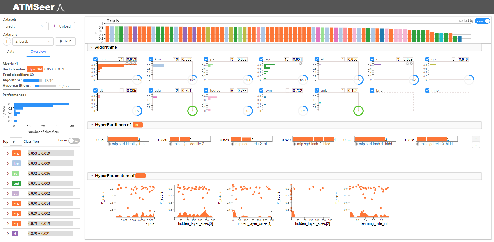

# A GUI for the ATM framework

# Demo

You can see the demo in the website [http://atm.hkustvis.org](http://atm.hkustvis.org)

The screenshot of the demo is shown below 



# Setup

First, run the following commands to clone ATM as a submodule

```
git submodule init 
git submodule update
```
Then, go to `lib/atm` and install ATM as described in [here](https://github.com/HDI-Project/ATM)

Note: as the scikit_learn has been updated and the new version of it is not compatible with current version of ATM, you should run the following commands

```
pip uninstall scikit_learn
pip install scikit_learn==0.19.2
```

After configuring the ATM, then go to `server/` and run `pip install -r requirements.txt`

The frontend runs in React. You'll need to have [npm](https://www.npmjs.com/get-npm) installed. Then, from the top level directory, run the following commands

```
npm install
npm run build
```

# Run

## Server

To start the server, first set `$PYTHONPATH` to include the local `atm_server` package: 
```bash
export PYTHONPATH=$PYTHONPATH:`pwd`/server/
```

Then start the atm server by: `python server/atm_server/server.py`

Or you can directly run `startserver.sh` to start the server

The routes (API) are defined in `server/atm_server/api.py`

# Build

## Build and Deploy with Docker

Run `scripts/build_with_docker.sh` to build the docker image

Run `scripts/start_docker.sh` to start the app